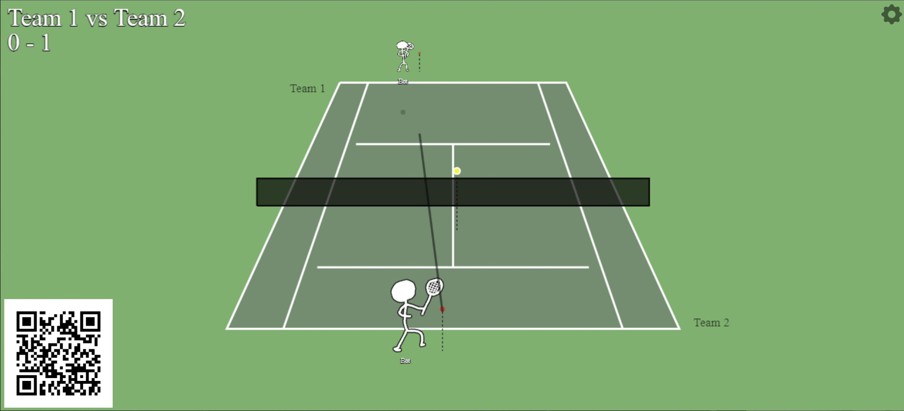

## Art

Gimp
135x200
brush 5 hardness 075
grow 2 fill behind

## Running the game:

- `npm i`
- `npm start`
- Open http://localhost:3000/game on the device where you want the tennis game to be visible
- To activate music and sound effects you have to click once on the tennis field in the web browser
- Open a command prompt and type ipconfig to find your devices IP address in the local WiFi
  - find the IPv4 address in particular.
- Open (ip found in previous step):3000/play-tennis on at least two different mobile phones to play the game
  - for example, "192.168.1.157:3000/play-tennis"
  - You have to be connected to the same network/WiFi as the machine thats hosting the game!

## How to play the game:

- Most of the time you have two controls: Move and Aim
- The main idea of the controls is that you just hold the Aim button all the time (you can see in the field an arrow where you are aiming) and then just try to run into the ball to hit it.
- If the control movement seems buggy, you may want to try a different browser (Chrome seems to work well at least)
- You can tweak game settings in the main game view by pressing the settings button in top-right
  - You can activate "LOB" button from here once you feel ready for advanced tactics :>
  - You can also add bots, and increase ball speed (super entertaining to watch!)
- There's also player specific settings under each players own settings button
- Ignore the QR code (its hardcoded to my home IP)
- It's super buggy so have fun !!
